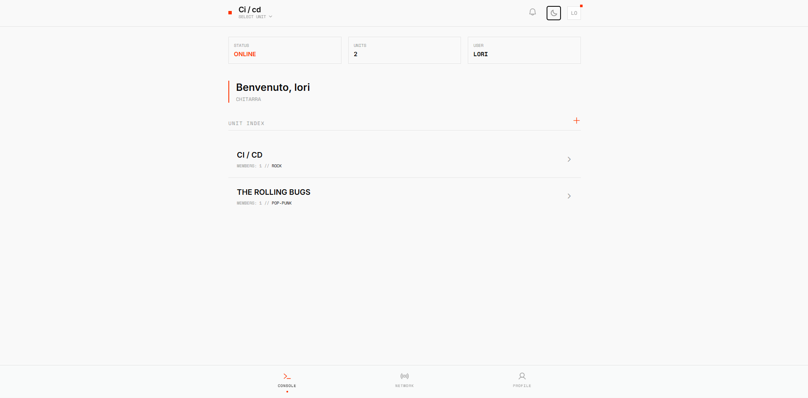
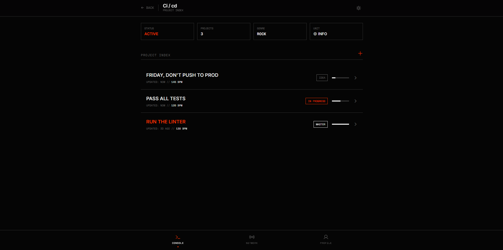
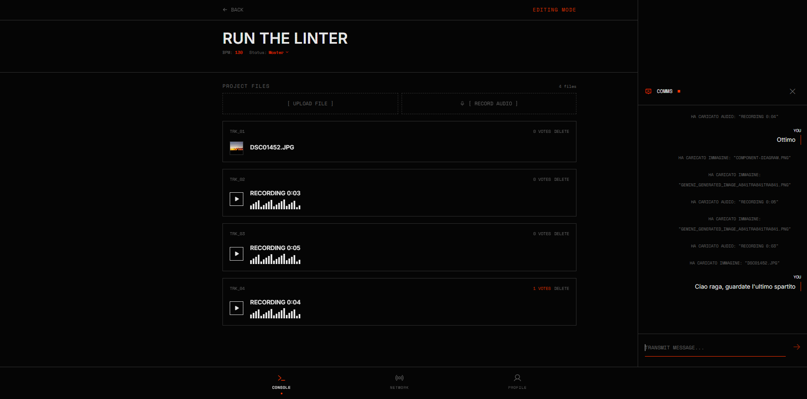
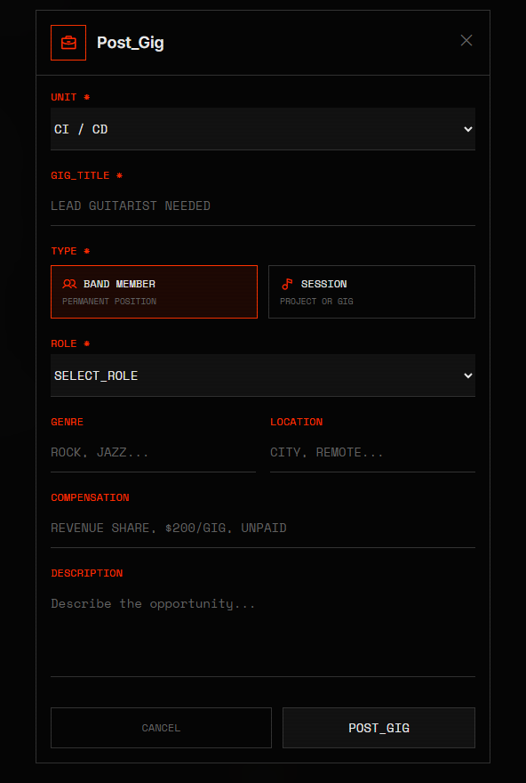

# RiffBanks

A collaborative platform for musicians and bands to manage musical projects, communicate in real-time, and find collaboration opportunities.

## Overview

RiffBanks is a unified digital workspace designed specifically for musicians. The platform addresses the common challenge of fragmented collaboration tools by integrating three core functionalities:

- **Band Management**: Create and manage bands with a unique invite code system
- **Musical Projects**: Organize songs with asset versioning, real-time chat, and voting system
- **Gig Economy**: A bulletin board for recruiting musicians (permanent positions or session collaborations)

## Features

- User authentication with JWT tokens
- Band creation with auto-generated invite codes (format: XX-XXX-000)
- Song workflow management (Idea, In Progress, Mix, Master)
- File uploads for audio (mp3, wav, ogg, webm) and images (jpg, png, gif)
- Real-time chat per song using WebSocket (Socket.io)
- Voting system on assets with live updates
- Gig postings for member recruitment or session work
- Mobile-first responsive design

## Tech Stack

- **Frontend**: Vue.js 3 (Composition API), Pinia, Vue Router, Tailwind CSS
- **Backend**: Node.js, Express 4, Socket.io
- **Database**: MongoDB with Mongoose ODM
- **Containerization**: Docker, Docker Compose
- **Web Server**: Nginx (reverse proxy)

## Screenshots

### Home Dashboard


### Songs List


### Song Detail


### Gig Detail


## Deployment with Docker

### Prerequisites

- Docker
- Docker Compose

### Quick Start

1. Clone the repository:
```bash
git clone https://github.com/LoryBug/RiffBanks.git
cd RiffBanks
```

2. (Optional) Set a custom JWT secret:
```bash
export JWT_SECRET=your-secret-key
```

3. Start the application:
```bash
docker-compose up -d
```

4. Verify the containers are running:
```bash
docker-compose ps
```

The application will be available at `http://localhost` (port 80).

### Container Architecture

| Container | Image | Port | Role |
|-----------|-------|------|------|
| riffbanks-mongodb | mongo:latest | 27017 | Document database |
| riffbanks-server | Node 20 Alpine | 3333 | Express API + Socket.io |
| riffbanks-client | nginx Alpine | 80 | Vue frontend + Reverse Proxy |

### Environment Variables

| Variable | Default | Description |
|----------|---------|-------------|
| NODE_ENV | production | Execution environment |
| PORT | 3333 | Express server port |
| MONGODB_URI | mongodb://mongodb:27017/riffbanks | Database connection string |
| JWT_SECRET | riffbanks | JWT signing key |
| JWT_EXPIRES_IN | 7d | Token expiration |
| CLIENT_URL | http://localhost | Frontend URL for CORS |

### Data Persistence

Docker Compose creates two named volumes:
- `riffbanks-mongodb-data`: MongoDB data
- `riffbanks-uploads-data`: User uploaded files

### Stopping the Application

```bash
docker-compose down
```

To also remove volumes (this will delete all data):
```bash
docker-compose down -v
```

## Project Structure

```
RiffBanks/
├── client/                 # Vue.js frontend
│   ├── src/
│   │   ├── components/     # Reusable components
│   │   ├── views/          # Page components
│   │   ├── stores/         # Pinia stores
│   │   ├── services/       # API client
│   │   └── routes/         # Vue Router config
│   ├── Dockerfile
│   └── nginx.conf
├── server/                 # Express backend
│   ├── controllers/        # Request handlers
│   ├── models/             # Mongoose schemas
│   ├── routes/             # API endpoints
│   ├── middleware/         # Auth, upload
│   ├── socket/             # WebSocket handlers
│   └── Dockerfile
└── docker-compose.yml
```

## License

This project was developed as part of the Web Applications and Services course at University of Bologna.
