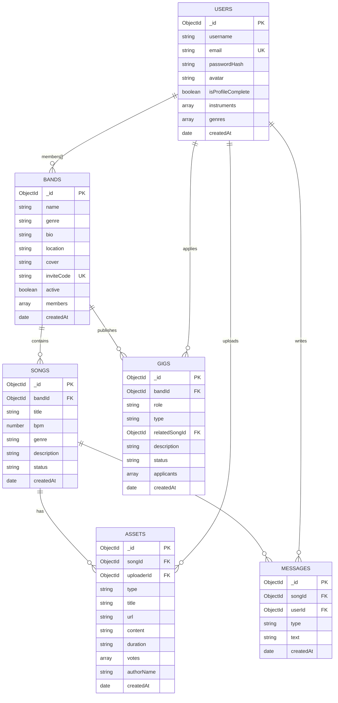
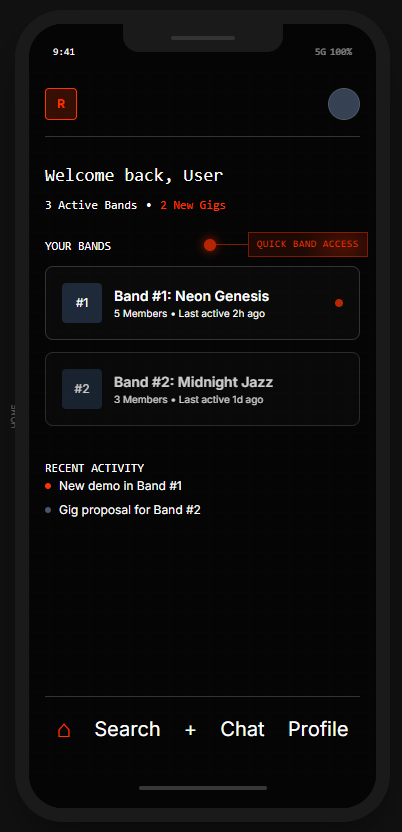
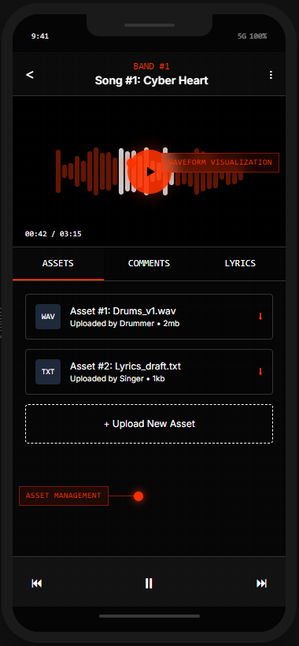
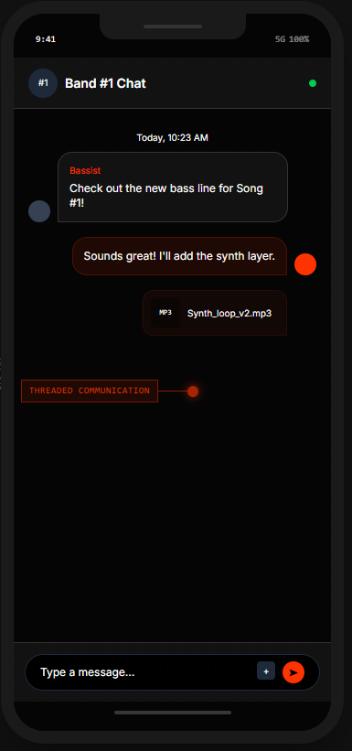
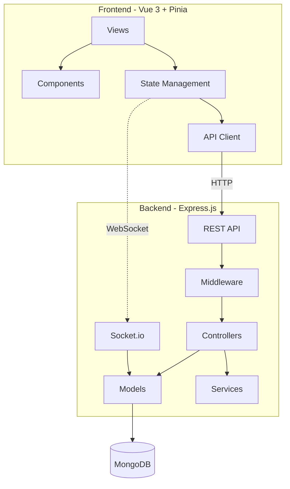
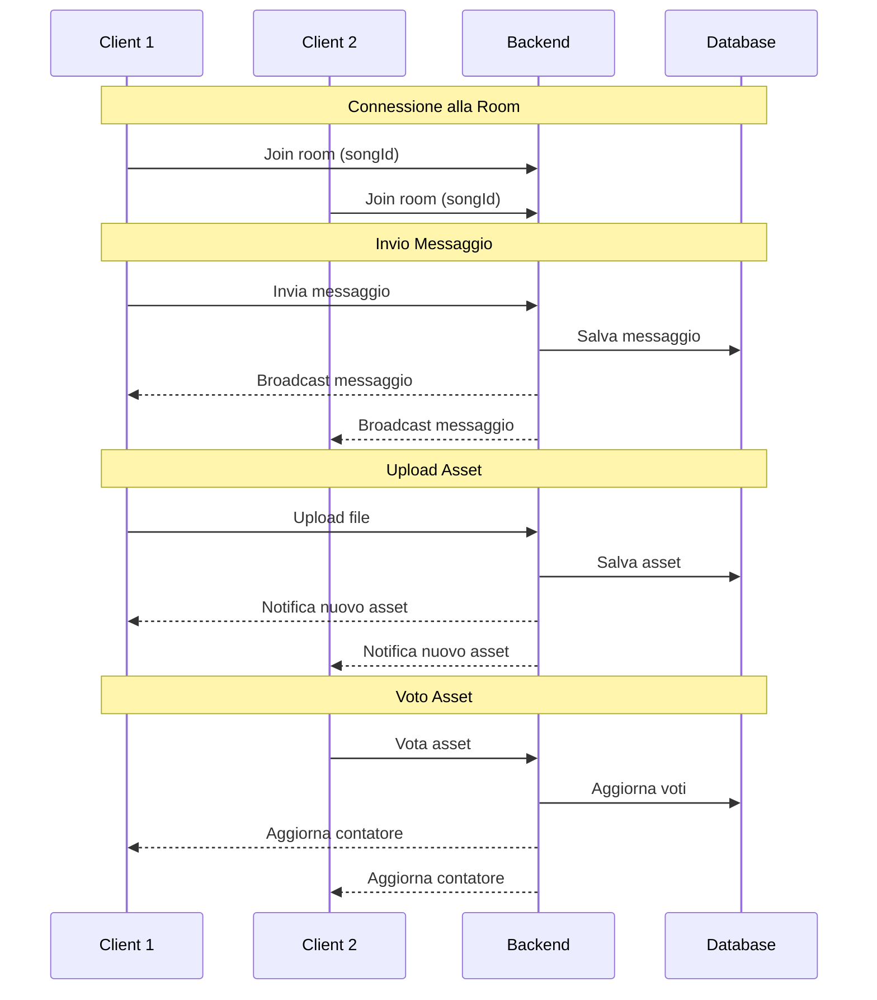

# Riffbanks - Piattaforma collaborativa per musicisti

## Introduzione


Nel panorama musicale contemporaneo, i musicisti e le band si trovano quotidianamente ad affrontare una sfida organizzativa significativa: la gestione della collaborazione attraverso strumenti frammentati e disconnessi tra loro. Le conversazioni avvengono su WhatsApp o Telegram, i file audio vengono condivisi tramite Google Drive o WeTransfer, il coordinamento delle sessioni passa attraverso email, e la ricerca di nuovi collaboratori richiede la consultazione di molteplici piattaforme e gruppi social. Questa frammentazione genera inefficienze considerevoli, dalla difficolta nel reperire versioni specifiche di un brano alla perdita di contesto nelle discussioni creative.

RiffBanks nasce con l'obiettivo di risolvere queste problematiche offrendo uno spazio digitale unificato pensato specificamente per le esigenze dei musicisti. La piattaforma integra quattro funzionalita fondamentali: la gestione strutturata dei progetti musicali con versionamento degli asset, un sistema di comunicazione in tempo reale contestualizzato per ogni brano e una bacheca per il recruiting di musicisti (denominata "Gig Economy").

Il target principale dell'applicazione comprende musicisti amatoriali e semi-professionali, band in fase di formazione o consolidamento, e session musician alla ricerca di opportunita di collaborazione. L'interfaccia è stata progettata con un approccio mobile-first, riconoscendo che gran parte delle interazioni tra musicisti avviene in mobilita, durante le prove o negli spostamenti.

## Requisiti

### Analisi dell'utenza

Per comprendere a fondo le esigenze degli utenti finali, sono state definite tre personas rappresentative che incarnano i principali profili di utilizzo della piattaforma.

La prima persona è Marco, un chitarrista che suona stabilmente in una band rock composta da quattro elementi. Marco necessita di uno strumento efficace per condividere demo e ricevere feedback dai compagni di band, oltre a voler mantenere traccia delle diverse iterazioni di ogni brano durante il processo creativo. La sua frustrazione principale riguarda la dispersione delle informazioni: "Abbiamo tre gruppi WhatsApp diversi e non riesco mai a trovare i file quando mi servono".

La seconda persona è Giulia, una cantautrice che lavora principalmente in autonomia sulla scrittura di testi e melodie. Giulia cerca regolarmente musicisti a chiamata per le fasi di registrazione dei suoi brani e ha bisogno di strumenti che la aiutino a superare i momenti di blocco creativo. Si chiede spesso dove poter trovare un batterista disponibile per una sessione di registrazione senza dover contattare decine di conoscenti.

La terza persona è Alessandro, un bassista freelance che lavora come musicista a chiamata per diverse band e progetti. Alessandro è costantemente alla ricerca di nuove opportunita di collaborazione e necessita di un modo efficiente per presentare il proprio profilo artistico. Attualmente deve monitorare numerose piattaforme e gruppi social per trovare offerte di lavoro, con un notevole dispendio di tempo.

### Requisiti Utente

Dall'analisi dell'utenza emergono i requisiti che l'applicazione deve soddisfare dal punto di vista dell'esperienza utente. Gli utenti devono poter gestire un'area riservata personale contenente il proprio profilo con le preferenze musicali, inclusi gli strumenti suonati e i generi di riferimento. Devono poter creare nuove band e gestirne i membri attraverso un sistema di inviti basato su codici univoci, eliminando la necessita di condividere indirizzi email o altri dati personali.

La gestione dei contenuti musicali rappresenta il cuore dell'applicazione: gli utenti devono poter caricare e organizzare file audio e immagini associandoli a specifici brani, comunicare in tempo reale con gli altri membri della band nel contesto di ciascuna canzone, e ricevere notifiche tempestive per nuovi messaggi e attivita rilevanti. Per quanto riguarda l'aspetto sociale, gli utenti devono poter cercare opportunita di collaborazione nella bacheca pubblica e candidarsi a quelle di interesse. Infine, devono poter accedere a strumenti di generazione testuale assistita per supportare il processo creativo.

### Requisiti Funzionali

#### Autenticazione e Gestione Utente
- Registrazione di nuovi utenti
- Login sicuro con generazione di token JWT
- Gestione del profilo personale tramite wizard di onboarding per la configurazione iniziale

#### Gestione delle Band
- Creazione di nuove band con generazione automatica di codice invito univoco (formato: XX-XXX-000)
- Condivisione del codice invito con potenziali membri
- Possibilita di unirsi a una band inserendo il codice nell'apposita sezione
- Gestione automatica dei ruoli:
  - Amministratori
  - Membri semplici

#### Progetti Musicali
- Operazioni CRUD complete sulle canzoni
- Workflow di stato per ogni canzone:
  1. Idea
  2. In Progress
  3. Mix
  4. Master
- Tipologie di asset associabili:
  - File audio caricati dall'utente
  - Immagini di riferimento
- Sistema di voto sugli asset:
  - Possibilita per i membri della band di esprimere preferenze
  - Conteggio aggiornato in tempo reale

#### Comunicazione
- Chat integrata per ogni canzone con:
  - Messaggi degli utenti
  - Notifiche di sistema (upload e altre attività significative)

#### Modulo Gig Economy
- Pubblicazione di annunci di due tipologie:
  - **Member**: posizioni permanenti nella band
  - **Session**: collaborazioni temporanee su specifici progetti
- Candidatura degli utenti agli annunci

### Requisiti Non Funzionali

#### Usabilità
- Interfaccia intuitiva e user-friendly
- Design ottimizzato per dispositivi mobili (approccio mobile-first)

#### Accessibilita (WCAG 2.1 livello AA)
- Supporto per screen reader tramite attributi ARIA appropriati
- Touch target di dimensioni minime 44x44 pixel per dispositivi touch

#### Sicurezza
- Autenticazione tramite token JWT stateless con scadenza configurabile
- Password memorizzate con hashing bcrypt (10 salt rounds)
- Validazione di tutti gli input utente per prevenire injection e altri attacchi comuni

#### Performance e Scalabilità
- Tempi di risposta delle API inferiori a 200 millisecondi
- Architettura stateless del backend per scalabilita orizzontale
- Aggiornamenti in tempo reale (chat, notifiche, conteggio voti) tramite WebSocket con Socket.io

## Design

### Metodologia

Il sistema si basa su un database MongoDB organizzato in sei collezioni principali che modellano il dominio applicativo. 
- *"users"* memorizza i profili dei musicisti con le relative credenziali di autenticazione e le preferenze musicali espresse in termini di strumenti suonati e generi di riferimento. 
- *"bands"* rappresenta i gruppi di lavoro, contenendo il nome, il genere musicale, la localita geografica, il codice invito univoco e l'elenco dei membri con i rispettivi ruoli. 
- *"songs"* archivia i progetti musicali associati a ciascuna band, con metadati quali titolo, BPM, genere e stato di avanzamento nel workflow produttivo.
- *"assets"* contiene i file e i contenuti testuali associati alle canzoni, includendo il riferimento all'uploader, la tipologia (audio, immagine o testo), l'eventuale URL del file e l'array dei voti ricevuti. 
- *"messages"* gestisce la chat ibrida che combina messaggi degli utenti e log di sistema

Le relazioni tra le entita seguono un modello orientato ai documenti tipico di MongoDB. Un utente puo appartenere a molteplici band attraverso l'array di membri embedded in ciascuna band. Ogni band contiene multiple canzoni, referenziate tramite il campo bandId. A sua volta, ogni canzone puo avere associati numerosi asset e messaggi, collegati tramite il campo songId. Gli annunci gig sono pubblicati da una band specifica e raccolgono candidature da parte degli utenti interessati.

La struttura del database e le relazioni tra le entita sono rappresentate nel seguente diagramma:



---
L'architettura generale segue il pattern REST per le operazioni CRUD, affiancato dal protocollo WebSocket per le funzionalità che richiedono aggiornamenti in tempo reale. Il frontend comunica con il backend attraverso chiamate HTTP per le operazioni transazionali e mantiene una connessione WebSocket persistente per ricevere notifiche push relative a nuovi messaggi, aggiornamenti dei voti e altre attivita collaborative.

### Architettura delle Interfacce Utente

#### Design System e Fonti di Ispirazione

Prima dello sviluppo delle interfacce, è stato definito uno stile visivo distintivo per il progetto. Le principali fonti di ispirazione sono state:

- **Teenage Engineering**: brand noto per il design minimalista e funzionale dei propri dispositivi audio, caratterizzato da un'estetica industriale con accenti di colore vibranti e tipografia bold
- **Nothing**: azienda di consumer electronics riconoscibile per l'approccio visivo basato su trasparenze, elementi geometrici e un linguaggio grafico pulito con forte identita

Da queste influenze è stata creata una mood board contenente palette colori, font di riferimento e screenshot dei prodotti di ispirazione, insieme alla definizione delle funzionalità che ogni schermata principale doveva offrire.

#### Processo di Creazione dei Mockup

Per la realizzazione dei mockup e stato adottato un approccio non convenzionale: invece di utilizzare strumenti tradizionali come Figma, si è scelto di sperimentare con **Gemini 3.0 Flash** utilizzando la funzionalità Canvas. Partendo dalla mood board e dalle specifiche funzionali delle schermate, sono state condotte diverse iterazioni di prompt e raffinamenti successivi che hanno portato alla generazione dei mockup finali.

Questo approccio ha permesso di:
- Esplorare rapidamente molteplici varianti stilistiche
- Iterare velocemente sul feedback visivo
- Mantenere coerenza con il design system definito

#### Mockup

Di seguito i mockup delle schermate principali dell'applicazione:


*Dashboard principale con elenco delle band*


*Vista dettaglio canzone con player e asset*


*Chat integrata per la comunicazione contestuale*

#### Viste dell'Applicazione

L'applicazione si articola nelle seguenti viste principali:

- **Autenticazione**: form per login e registrazione
- **Onboarding**: wizard di configurazione iniziale del profilo
- **Dashboard**: panoramica delle band e accesso alla bacheca gig
- **Dettaglio Band**: informazioni, membri e impostazioni della band
- **Lista Canzoni**: elenco dei brani con indicatori di stato
- **Dettaglio Canzone**: player audio, asset e chat contestuale
- **Gig**: bacheca annunci con filtri di ricerca

## Tecnologie

Lo stack tecnologico adottato e il **MEVN** (MongoDB, Express, Vue.js, Node.js), arricchito da Socket.io per le funzionalita real-time.

### Backend

**Runtime e Framework**
- **Node.js 18+**: modello asincrono non bloccante, adatto ad applicazioni con elevata concorrenza
- **Express 4**: framework web per API RESTful con gestione middleware

**Persistenza Dati**
- **MongoDB**: database documentale NoSQL, flessibile per dati musicali e collaborativi
- **Mongoose**: ODM con validazione schema, middleware e query builder

**Real-time**
- **Socket.io**: WebSocket con fallback automatico su polling, organizzazione in "room" per canzone

**Autenticazione e Sicurezza**
- **jsonwebtoken**: autenticazione stateless tramite JWT
- **bcryptjs**: hashing password con algoritmo bcrypt (10 salt rounds)

**Upload File**
- **Multer**: parsing multipart/form-data con limite 50MB per file
- Formati accettati: audio (mp3, wav, ogg, webm) e immagini (jpg, png, gif)

### Frontend

**Framework e Architettura**
- **Vue.js 3** con Composition API e sintassi `<script setup>` per logica reattiva concisa
- **Pinia**: state management centralizzato per autenticazione e connessione Socket.io
- **Vue Router**: routing client-side con navigation guard e lazy loading delle viste

**Build e Sviluppo**
- **Vite**: Hot Module Replacement istantaneo, proxy API integrato per lo sviluppo

**UI e Styling**
- **Tailwind CSS**: approccio utility-first per styling inline
- **Lucide Vue Next**: libreria icone
- **Axios**: client HTTP con interceptor per JWT e gestione errori autenticazione

## Codice

### Struttura del Progetto
Il progetto adotta una struttura monorepo gestita attraverso npm workspace, con due package principali: 
- client, con la parte contenente il frontend in VUE
- server, backend express
Questa organizzazione permette di condividere configurazioni e script a livello di root mantenendo al contempo una chiara separazione di responsabilità.

#### Client
La cartella client contiene l'applicazione Vue organizzata secondo le convezioni del framework. 
- **components** ospita i vari componenti riutilizzabili come ad asempio AudioPlayer, ChatPanel, GigGard e i vari modal.
- **views** contiene i componenti che rappresentano le varie pagine dell'applicazione, mappati alle route definite nel router.
- **stores** contiene Pinia store per auth e socket.
- **services** contiene il modulo api che centralizza tutte le chiamate HTTP.
- **routes** definisce tutte le route e i navigation guard

#### Server
Server contiene tutto il backend del progetto ed è organizzato nel seguente modo:
- **models** contiene gli schemi di Mongoose per le diverse collezioni del DB.
- **controllers** implementa la logica applicativa per ciascuna risorsa
- **routes** definisce tutti gli endpoint e li collega al controller
- **middleware** ospita i moduli per autenticazione e upload
- **services** contiene la logica di business riutilizzabile
- **socket** gestisce gli handler per gli eventi websocket

##### Diagramma dei componenti


### Pattern e Implementazioni Rilevanti

L'architettura complessiva segue un **pattern a strati** che garantisce separazione delle responsabilita:
1. **Route**: validazione preliminare e applicazione middleware
2. **Controller**: orchestrazione della logica applicativa
3. **Model**: accesso ai dati tramite Mongoose

#### Controller Backend: Gestione Band

Il controller `bandController.js` implementa le operazioni CRUD sulle band. Di seguito un estratto della funzione di creazione:

```javascript
// server/controllers/bandController.js
exports.create = async (req, res) => {
  try {
    const { name, genre, bio, location, instrument } = req.body;

    // Generate unique invite code
    let inviteCode;
    let isUnique = false;
    while (!isUnique) {
      inviteCode = Band.generateInviteCode(name);
      const existing = await Band.findOne({ inviteCode });
      if (!existing) isUnique = true;
    }

    const band = new Band({
      name, genre, bio, location, inviteCode,
      members: [{
        userId: req.userId,
        role: 'Admin',
        instrument: instrument || req.user.instruments?.[0] || '',
        joinedAt: new Date()
      }]
    });

    await band.save();
    await band.populate('members.userId', 'username avatar');
    res.status(201).json(band);
  } catch (err) {
    res.status(500).json({ error: 'Failed to create band' });
  }
};
```

La funzione `join` verifica l'esistenza della band e l'appartenenza dell'utente prima di aggiungerlo:

```javascript
// server/controllers/bandController.js
exports.join = async (req, res) => {
  const { inviteCode, instrument } = req.body;

  const band = await Band.findOne({
    inviteCode: inviteCode.toUpperCase(),
    active: true
  });

  if (!band) {
    return res.status(404).json({ error: 'Invalid invite code' });
  }

  if (band.isMember(req.userId)) {
    return res.status(400).json({ error: 'You are already a member of this band' });
  }

  band.members.push({
    userId: req.userId,
    role: 'Member',
    instrument: instrument || req.user.instruments?.[0] || '',
    joinedAt: new Date()
  });

  await band.save();
  res.json(band);
};
```

#### State Management Frontend: Auth Store

Lo store Pinia per l'autenticazione utilizza la Composition API:

```typescript
// client/src/stores/auth.ts
export const useAuthStore = defineStore('auth', () => {
  const user = ref<any>(null)
  const loading = ref(true)

  const isAuthenticated = computed(() => !!user.value)
  const needsOnboarding = computed(() => user.value && !user.value.isProfileComplete)

  async function checkAuth() {
    const token = localStorage.getItem('token')
    if (token) {
      try {
        const res = await authAPI.me()
        user.value = res.data
      } catch (err) {
        localStorage.removeItem('token')
      }
    }
    loading.value = false
  }

  async function login(email: any, password: any) {
    const res = await authAPI.login({ email, password })
    localStorage.setItem('token', res.data.token)
    user.value = res.data.user
    return res.data.user
  }

  function logout() {
    localStorage.removeItem('token')
    user.value = null
  }

  return { user, loading, isAuthenticated, needsOnboarding, checkAuth, login, logout }
})
```

#### Real-time: Socket.io

La gestione Socket.io lato server (`server/socket/index.js`) implementa:
- **Autenticazione** via middleware JWT
- **Room per canzone**: ogni client si unisce a `song:{songId}`
- **Broadcast messaggi**: eventi `send_message` → `new_message`

```javascript
// server/socket/index.js
socket.on('join_room', async (songId) => {
  const song = await Song.findById(songId);
  const band = await Band.findById(song.bandId);

  const isMember = band.members.some(m => m.userId.toString() === socket.userId);
  if (!isMember) {
    socket.emit('error', { message: 'Not a band member' });
    return;
  }

  socket.join(`song:${songId}`);
  socket.currentSongId = songId;
});

socket.on('send_message', async (data) => {
  const { songId, text } = data;

  const message = new Message({
    songId,
    userId: socket.userId,
    type: 'user',
    text: text.trim(),
    readBy: [socket.userId]
  });

  await message.save();
  await message.populate('userId', 'username profilePic');

  io.to(`song:${songId}`).emit('new_message', messageData);
});
```

#### Sistema di Voto

Il meccanismo di voto implementa un toggle like/unlike con notifica real-time:

```javascript
// server/controllers/assetController.js
exports.vote = async (req, res) => {
  const asset = await Asset.findById(req.params.id);

  const voteIndex = asset.votes.findIndex(v => v.equals(req.userId));
  const votedByMe = voteIndex === -1;

  if (votedByMe) {
    asset.votes.push(req.userId);      // Add vote
  } else {
    asset.votes.splice(voteIndex, 1);  // Remove vote
  }

  await asset.save();

  // Notify all clients in the room
  req.io.to(`song:${asset.songId}`).emit('vote_update', {
    assetId: asset._id,
    votes: asset.votes.length,
    action: votedByMe ? 'liked' : 'unliked'
  });

  res.json({ votes: asset.votes.length, votedByMe });
};
```

##### Diagramma comunicazione real-time


## Test

### Test Tecnici

La verifica del corretto funzionamento dell'applicazione e stata condotta attraverso diverse tipologie di test. Il testing cross-browser ha verificato la compatibilita con i principali browser desktop (Chrome, Firefox, Edge) e i browser mobile su sistemi iOS e Android. L'approccio mobile-first adottato durante lo sviluppo ha garantito che l'esperienza su dispositivi touch fosse ottimale fin dalle prime fasi.

Il testing delle API e stato eseguito sistematicamente utilizzando Postman, costruendo una collection che copre tutti gli endpoint con casi di test per i flussi nominali e per le condizioni di errore. Particolare attenzione e stata dedicata alla verifica dei meccanismi di autenticazione, testando il comportamento con token validi, scaduti e malformati.

Il funzionamento real-time e stato verificato simulando scenari con connessioni multiple simultanee, confermando la corretta propagazione degli eventi di chat e delle notifiche di sistema a tutti i client iscritti alla room interessata.

## Deployment

Il deployment dell'applicazione e stato progettato utilizzando **Docker** per garantire portabilita, riproducibilita e semplicita di installazione.

### Architettura dei Container

L'applicazione e composta da tre container orchestrati tramite Docker Compose:

| Container | Immagine | Porta | Ruolo |
|-----------|----------|-------|-------|
| `riffbanks-mongodb` | `mongo:latest` | 27017 | Database documentale |
| `riffbanks-server` | Node 20 Alpine | 3333 | API Express + Socket.io |
| `riffbanks-client` | nginx Alpine | 80 | Frontend Vue + Reverse Proxy |

### Build Multi-Stage del Frontend

Il Dockerfile del client utilizza un approccio multi-stage per ottimizzare l'immagine finale:

```dockerfile
# client/Dockerfile
FROM node:20-alpine AS builder
WORKDIR /app
COPY package*.json ./
RUN npm ci
COPY . .
RUN npm run build

FROM nginx:alpine
COPY nginx.conf /etc/nginx/conf.d/default.conf
COPY --from=builder /app/dist /usr/share/nginx/html
EXPOSE 80
CMD ["nginx", "-g", "daemon off;"]
```

Lo stage di build compila l'applicazione Vue, mentre lo stage di produzione serve solo i file statici risultanti tramite nginx.

### Configurazione Nginx

Il reverse proxy nginx gestisce il routing tra frontend e backend:

```nginx
# client/nginx.conf
server {
    listen 80;
    root /usr/share/nginx/html;

    # SPA fallback per Vue Router
    location / {
        try_files $uri $uri/ /index.html;
    }

    # Proxy API verso backend
    location /api {
        proxy_pass http://server:3333;
        proxy_http_version 1.1;
        proxy_set_header Upgrade $http_upgrade;
        proxy_set_header Connection 'upgrade';
    }

    # Proxy WebSocket per Socket.io
    location /socket.io {
        proxy_pass http://server:3333;
        proxy_http_version 1.1;
        proxy_set_header Upgrade $http_upgrade;
        proxy_set_header Connection "upgrade";
        proxy_read_timeout 86400;
    }

    # Proxy file uploads
    location /uploads {
        proxy_pass http://server:3333;
    }
}
```

La configurazione include inoltre:
- **Gzip compression** per ridurre il traffico di rete
- **Security headers**: X-Frame-Options, X-Content-Type-Options, X-XSS-Protection
- **Cache 1 anno** per asset statici (js, css, immagini, font)

### Persistenza dei Dati

Docker Compose definisce due volumi nominati per la persistenza:

```yaml
# docker-compose.yml
volumes:
  mongodb_data:
    name: riffbanks-mongodb-data    # Dati MongoDB
  uploads_data:
    name: riffbanks-uploads-data    # File caricati dagli utenti
```

### Variabili d'Ambiente

La configurazione e esternalizzata tramite variabili d'ambiente:

| Variabile | Valore Default | Descrizione |
|-----------|----------------|-------------|
| `NODE_ENV` | `production` | Ambiente di esecuzione |
| `PORT` | `3333` | Porta del server Express |
| `MONGODB_URI` | `mongodb://mongodb:27017/riffbanks` | Connection string database |
| `JWT_SECRET` | `riffbanks` | Chiave per firma token JWT |
| `JWT_EXPIRES_IN` | `7d` | Scadenza token |
| `CLIENT_URL` | `http://localhost` | URL frontend per CORS |

### Health Checks

Ogni container implementa un health check per il monitoraggio automatico:

**MongoDB**:
```yaml
healthcheck:
  test: ["CMD", "mongosh", "--eval", "db.adminCommand('ping')"]
  interval: 30s
  timeout: 10s
  retries: 3
```

**Server Express** (endpoint `/api/health`):
```javascript
app.get('/api/health', (req, res) => {
  res.json({ status: 'ok', message: 'RiffBank API is running' });
});
```

**Client nginx**:
```dockerfile
HEALTHCHECK --interval=30s --timeout=10s --start-period=5s --retries=3 \
  CMD wget --no-verbose --tries=1 --spider http://localhost/ || exit 1
```

### Avvio dell'Applicazione

Per avviare l'intero stack:

```bash
# Clonare il repository
git clone https://github.com/LoryBug/RiffBanks.git
cd RiffBanks

# Configurare JWT_SECRET (opzionale)
export JWT_SECRET=your-secret-key

# Avviare i container
docker-compose up -d

# Verificare lo stato
docker-compose ps
```

L'applicazione sara disponibile su `http://localhost` (porta 80).

### Dipendenze tra Servizi

Docker Compose gestisce l'ordine di avvio:
1. **MongoDB** si avvia per primo
2. **Server** attende che MongoDB sia healthy (`condition: service_healthy`)
3. **Client** attende che il server sia disponibile
## Conclusioni

Il progetto RiffBanks ha raggiunto la maggior parte degli obiettivi prefissati, portando a termine lo sviluppo di una piattaforma funzionante che risponde alle esigenze identificate in fase di analisi.

Il prodotto finale offre un'esperienza d'uso coerente e intuitiva, permettendo ai musicisti di gestire le proprie band, organizzare i progetti musicali, comunicare in tempo reale e cercare opportunita di collaborazione attraverso un'unica interfaccia. L'approccio mobile-first ha garantito un'esperienza ottimale sui dispositivi che i musicisti utilizzano maggiormente nella loro quotidianita.

### Sviluppi Futuri

Per quanto riguarda le funzionalita che interessano gli utenti, un'evoluzione futura del sistema potra concentrarsi su possibili estensioni quali:

- **Notifiche push**: implementazione di un sistema di notifiche push per dispositivi mobili, in modo da avvisare gli utenti di nuovi messaggi o attivita anche quando l'applicazione non e in primo piano
- **Player audio avanzato**: integrazione di funzionalita di editing audio base (trim, fade) e visualizzazione della forma d'onda per una migliore gestione degli asset musicali
- **Storage cloud**: migrazione dello storage dei file su servizi cloud (AWS S3, Cloudinary) per migliorare scalabilita e affidabilita
- **Sistema di recensioni**: possibilita per i membri delle band di lasciare feedback sui collaboratori incontrati tramite la sezione Gig Economy

Dal punto di vista tecnico, sarebbe interessante esplorare:

- **PWA (Progressive Web App)**: trasformazione dell'applicazione in PWA per consentire l'installazione su dispositivi mobili e l'utilizzo offline
- **CI/CD Pipeline**: automazione dei processi di testing e deployment tramite GitHub Actions

### Commenti Finali

Lo sviluppo di questo progetto ha permesso di mettere in pratica le conoscenze acquisite durante il corso, affrontando le sfide tipiche dello sviluppo web moderno: dalla progettazione di API RESTful alla gestione della comunicazione real-time tramite WebSocket, dall'autenticazione JWT alla containerizzazione con Docker.

Particolarmente formativa e stata l'esperienza con lo stack MEVN, che ha richiesto di padroneggiare tecnologie diverse ma coerenti tra loro, dalla reattivita di Vue.js con la Composition API alla flessibilita di MongoDB come database documentale.

Un aspetto interessante del processo di sviluppo e stato l'utilizzo di strumenti di intelligenza artificiale generativa per la creazione dei mockup, un approccio non convenzionale che ha permesso di esplorare nuove modalita di prototipazione rapida.

L'idea di RiffBanks nasce da un'esigenza concreta riscontrata nel mondo della musica amatoriale: la frammentazione degli strumenti di collaborazione. Questo ha permesso di sviluppare con maggiore consapevolezza le funzionalita necessarie, potendo valutare in prima persona l'utilita delle scelte implementative.